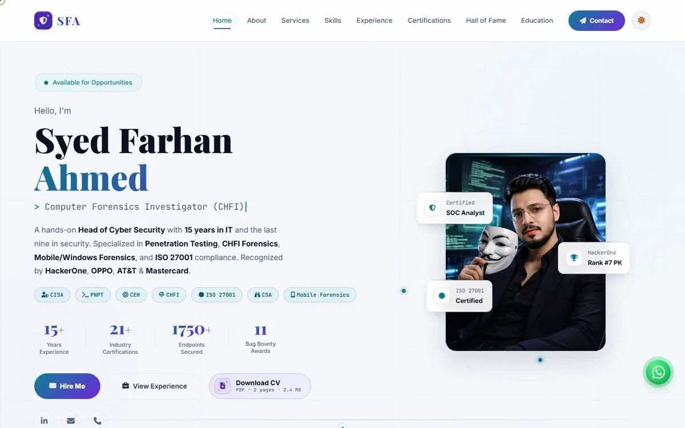
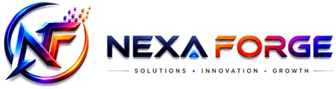

<a href="https://farhan6667.github.io/portfolio/">
  <picture>
    <source media="(prefers-color-scheme: dark)" srcset="readme-assets/preview-dark.webp">
    
  </picture>
</a>

# Syed Farhan Ahmed, portfolio

Cyber security · Digital forensics · Detection engineering

**[Open the live site](https://farhan6667.github.io/portfolio/)** ·
[Download the CV](Syed_Farhan_Ahmed_CV.pdf) ·
[LinkedIn](https://www.linkedin.com/in/sfa6667)

## What is on the site

A one-page personal site with a light and a dark theme. The sections are:

- **About** and **Services**: who I am and what I take on.
- **Skills**, **Experience**, **Education**: the working background.
- **Certifications** and **Hall of Fame**: credentials and bug bounty recognition.
- **Contact**: email, LinkedIn and WhatsApp.

The CV is a two page PDF and sits in this repository next to the page.

## How it is built

The whole site is a single static `index.html`. There is no build step and no framework to install, and GitHub Pages serves it as it is. To work on it locally, open `index.html` in a browser. The page carries a Content Security Policy and loads libraries only from a short list of known CDNs.

| File | Purpose |
|---|---|
| `index.html` | The page, with its styles and scripts |
| `Syed_Farhan_Ahmed_CV.pdf` | Downloadable CV |
| `profile.jpg`, `about-dark.jpg`, `about-light.jpg` | Photos used per theme |
| `readme-assets/` | Images for this README only |

## Other work

- [no-api-media-mcp](https://github.com/farhan6667/no-api-media-mcp): make images and videos from Claude Code, Cursor or Codex with the subscriptions you already pay for.
- [Wazuh RuleGuard](https://github.com/farhan6667/wazuh-ruleguard): test Wazuh detection changes before they ship.
- [Wazuh NoiseLens](https://github.com/farhan6667/wazuh-noiselens): see which alerts a proposed exception would hide.

## Ownership

This is a personal site. The text, photos and CV belong to Syed Farhan Ahmed, so please don't copy them.

---

<a href="https://nexaforge.eu.cc/">
  <picture>
    <source media="(prefers-color-scheme: dark)" srcset="readme-assets/nexaforge-lockup-dark.webp">
    
  </picture>
</a>
&nbsp;&nbsp;

**Built by [Syed Farhan Ahmed](https://github.com/farhan6667) (SFA)** at **[NexaForge](https://nexaforge.eu.cc/)** 
Cyber security · Vibe coding · Web development and IT infrastructure

[Website](https://nexaforge.eu.cc/) ·
[LinkedIn](https://www.linkedin.com/in/sfa6667) ·
[Email](mailto:nexaforge.services@gmail.com)

